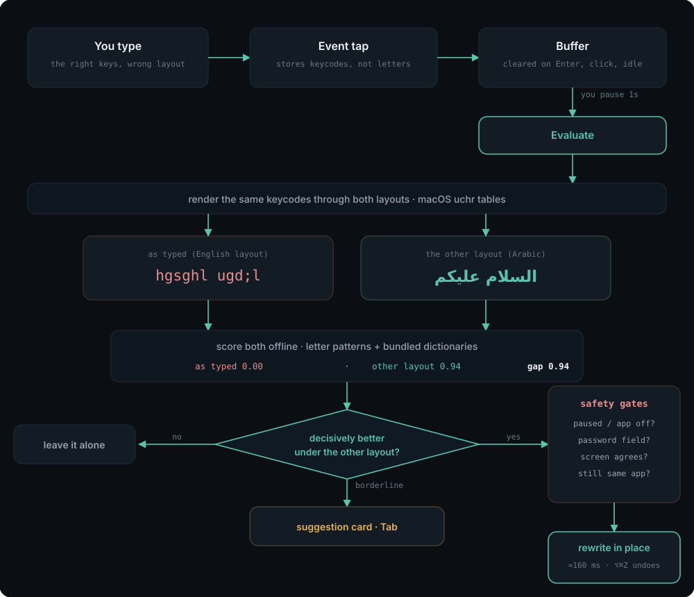

<p align="center">
  <picture>
    <source media="(prefers-color-scheme: dark)" srcset="docs/brand/harf-lockup-dark.svg">
    <source media="(prefers-color-scheme: light)" srcset="docs/brand/harf-lockup-light.svg">
    
  </picture>
</p>

# Harf

Harf (حرف, "letter") is a macOS menu-bar utility that fixes text typed with the wrong keyboard
layout. Typing Arabic while the US layout is active — or English while Arabic
is — produces mojibake such as `hgsghl` instead of `السلام`. Harf watches what
you type, notices when a word only makes sense under the other layout, deletes
what is on screen and types the correction in its place, switching the keyboard
layout as it goes.

It runs as a background agent with no Dock icon, makes no network request unless
you explicitly ask it to check for a new version, and keeps everything it
observes on the machine. Version 1.0.1, macOS 14 or newer.

## Why this exists

If you write in two languages all day, you do not think about the keyboard
layout — you think about the sentence. So you switch to English to paste a link
or answer a colleague, then come back to write in Arabic and start typing
without switching back. Nothing warns you. The first sign that anything is wrong
is a line of nonsense on the screen:

    hgsghl ugdj      instead of   السلام عليك
    اخص ه يهي صاشف    instead of   how i did what

The text is not lost, it is simply being drawn through the wrong table: every
key you pressed was the right key. But there is no way to tell macOS that, so
the ritual is always the same — select the line, delete it, find the layout
switcher, and type the whole thing again. A dozen times a day, that is real time
and real irritation, and it interrupts the thing you were actually thinking
about.

Harf removes the ritual. It notices the moment you pause, works out that what
you typed is only meaningful under the other layout, and rewrites it in place —
switching the keyboard for you, so the next word you type is already in the
language you meant. You keep writing. In practice you stop noticing that you
ever forgot.

The reverse direction is handled the same way: English typed while Arabic is
active comes out as `اخص ه`, and gets turned back into `how i`.

## How it works

<p align="center">
  
</p>

The diagram is also available as an [editable Excalidraw
canvas](docs/dodoma-how-it-works.excalidraw) — drag it onto
[excalidraw.com](https://excalidraw.com) to rearrange it.

Three illustrated walkthroughs live in `docs/`. Each opens straight from the
browser — no checkout required:

| | What it is | Open it |
|---|---|---|
| **Slide deck** | 13 slides covering the whole pipeline, the safety gates, and the two bugs that only live use found. Arrow keys or space to advance. | [view](https://htmlpreview.github.io/?https://raw.githubusercontent.com/alialhawas/Language-changer/auto-detect-keyboard-language-switch/docs/how-it-works.html) · [source](docs/how-it-works.html) |
| **Diagram** | The flow above as an editable canvas — every box and arrow can be moved. | [open in Excalidraw](https://excalidraw.com/#url=https://raw.githubusercontent.com/alialhawas/Language-changer/auto-detect-keyboard-language-switch/docs/dodoma-how-it-works.excalidraw) · [SVG](docs/how-it-works.svg) |
| **Capture &amp; segmentation** | 10 slides answering one question in detail: is text judged word by word or a line at a time, and how are the words captured in the first place. | [view](https://htmlpreview.github.io/?https://raw.githubusercontent.com/alialhawas/Language-changer/auto-detect-keyboard-language-switch/docs/how-capture-works.html) · [source](docs/how-capture-works.html) |

GitHub serves `.html` as plain text rather than rendering it, which is why the
deck link goes through `htmlpreview` — it fetches the raw file and renders it in
place. Nothing is uploaded anywhere.

The [Harf origin story](docs/why-we-built-harf.html) covers the Arabic/English
workflow that inspired the app, interactive system diagrams, and setup. Readers
can switch the complete article between English and Arabic. It uses Hatif
branding with PlanetScale-style illustrations. Open the HTML file from a
checkout; keep the adjacent `docs/assets/` directory for its logo, fonts, and SVG.


Harf does not read the characters on your screen and guess. It records the
**key codes** you pressed — physical positions on the keyboard, which are the
same whatever layout is active — and after one second of not typing it renders
that key sequence twice: once through the layout you actually had selected, and
once through the other one. Both renderings are real text produced by macOS's
own `uchr` tables, not a character substitution table, so shifted keys, Caps
Lock and the Arabic layout's `لا` ligature all come out right.

The two renderings are then scored against an offline language model per
language: a letter-bigram probability and a dictionary-coverage fraction over a
list of up to 40,000 words, combined into one number. If the alternate layout scores far
better than what is on screen, and none of the guards fire — too short, mostly
digits, an email address or a path, a word that is legitimate in both languages
— Harf acts. How much better "far better" has to be is the **aggressiveness**
setting. A clear win is rewritten silently; a narrower one is offered as a
suggestion card next to the caret; anything else is ignored and forgotten.

## Install

The bundle identifier is `com.ali.dodoma` and the signing identity is
`Dodoma Dev`, both left over from the working name. Neither is user-visible, and
changing the identifier would make macOS treat Harf as a different application
and drop its Accessibility and Input Monitoring grants, so they stay.


### From a release

Download the disk image, drag the app to Applications, and grant the two
permissions it asks for.

macOS will refuse to open it the first time. The build is signed, but with a
self-signed certificate rather than an Apple Developer ID, so Gatekeeper treats
it exactly as it treats any unnotarised download. To open it anyway: **System
Settings → Privacy & Security**, scroll to the message naming Harf, and press
**Open Anyway**. That is once, not every launch.

### With Homebrew

Harf installs from its own tap:

    brew tap alialhawas/harf
    brew install --cask alialhawas/harf/harf

Homebrew 6 refuses to load a cask from any tap outside its own index unless you
have trusted it. Installing by its fully qualified name is the trust: it grants
trust to that one cask and nothing else, which is why there is no `brew trust`
step above. `brew trust alialhawas/harf` is the alternative — it trusts the
whole tap, present and future, and then the short name `brew install harf`
works. Prefer the qualified form.

Homebrew 6 does not tap on your behalf, so the `brew tap` line is required.

To upgrade it later:

    brew upgrade --cask alialhawas/harf/harf

That quits the running copy before replacing the bundle, which it has to: Harf
holds a keyboard event tap, and deleting the bundle from under it would leave it
tapping the keyboard with no app behind it. `harf --update` runs this for you
after checking whether there is anything to install.

macOS will still refuse the app the first time, because it is not notarised.
Allow it once under **System Settings → Privacy & Security → Open Anyway**.

`--no-quarantine` would skip that prompt, and this README will not recommend it.
The flag turns Gatekeeper off for the install, and Harf asks for the two most
powerful permissions macOS grants — that is precisely the combination where the
check is worth keeping.

It is not in `homebrew/cask` itself, which is what would make a bare
`brew install harf` work with no tap line at all. Two separate bars stand in the
way, and only one of them is about popularity:

* **Gatekeeper.** `homebrew/cask` requires that an app Gatekeeper can assess
  passes its checks, and that installing it never requires Gatekeeper to be
  bypassed. An unnotarised build fails that outright, so no amount of
  popularity would get this in as it stands.
* **Notability.** At least 225 stars, 90 forks or 90 watchers for a
  self-submission by the repository owner — 75 stars if someone else submits it
  — on a repository at least 30 days old.

The first is the one that matters, and it is the same $99 as everything else on
this page. A tap needs neither.

The cask also puts the binary on your PATH as `harf`, so every setting is
readable and writable from a shell:

    harf --status                  # every setting, permission and list
    harf --set confident 70        # fix short words scoring 70% or better
    harf --set buffer 60           # hold fewer keystrokes in memory
    harf --set idle 5              # drop them after 5s of silence
    harf --set learn off           # stop learning words, erase the file
    harf --policy com.apple.Terminal off
    harf --words add kubectl --lang en
    harf --decide "hgsghl ugd;l"   # why it would or would not act
    harf --help


### Building it yourself

    scripts/make-cert.sh    # once — a stable signing identity, so the
                            # permission grants survive rebuilds
    make install            # build, sign, install to /Applications, launch

`make dmg` produces the disk image.

### What proper distribution would take

Everything above works, and none of it is how a shipped Mac app should feel. The
Gatekeeper friction has one cause: the app is not notarised. Fixing that is not a
code change:

| | | |
|---|---|---|
| Hardened runtime | required by Apple before it will notarise | done — every build |
| Secure timestamp | required by Apple before it will notarise | done — Developer ID builds |
| Apple Developer Program | $99/year | you |
| Developer ID Application certificate | issued by Apple, replaces the self-signed one | you |
| Notarisation and stapling | `scripts/release.sh` runs both | done |

The build already carries the hardened runtime, and it needs no entitlement
exceptions to do so: Accessibility and Input Monitoring are TCC grants rather
than entitlements, so there is no entitlements file to get wrong. Only the
certificate is missing.

Once the Developer Program membership is active:

```
scripts/devid-setup.sh request           # makes a signing request to upload
# ... download the certificate from developer.apple.com ...
scripts/devid-setup.sh install ~/Downloads/developerID_application.cer

xcrun notarytool store-credentials harf-notary \
    --apple-id <you@example.com> --team-id <TEAMID> \
    --password <app-specific-password>   # from appleid.apple.com, not your
                                         # account password

SIGN_IDENTITY="Developer ID Application: Your Name (TEAMID)" \
NOTARY_PROFILE=harf-notary \
TAP_REPO=alialhawas/homebrew-harf \
    ./scripts/release.sh
```

The private key is generated locally and never sent to Apple; only the signing
request, which carries the public half, is uploaded.

The release script refuses to start if the working tree is dirty, if `HEAD` has
not been pushed (GitHub cannot tag a commit it has never seen), if the signing
identity is not in the keychain, if `NOTARY_PROFILE` is set and the identity is
not a Developer ID, or if the notary profile does not exist — the failures that
otherwise surface only after a build has been uploaded.

The keychain check is the important one. `make sign` falls back to ad-hoc
signing when the identity is missing, and an ad-hoc build has a different
designated requirement every time, so publishing one drops the Accessibility
and Input Monitoring grants of everyone who updates. Local builds keep the
fallback; a release has to ask for it with `ALLOW_ADHOC=1`.

Each run bumps `CFBundleVersion` in `Resources/Info.plist` before building,
tags the exact commit that was built (`--target`), rewrites `Casks/harf.rb`
with the new version and checksum, and commits both so the tree is clean
afterwards. It does not push that commit.

With that, the disk image opens with a double-click and no warning, and the
Homebrew cask installs without a prompt. Nothing else about the app changes,
with one exception worth expecting: a Developer ID signature is a different
designated requirement from the self-signed one, so the first notarised build
you install will ask for Accessibility and Input Monitoring again.


### 1. A stable code-signing identity (once)

```
scripts/make-cert.sh
```

Harf needs Accessibility and Input Monitoring permissions, and macOS ties
those grants to the app's code signature. An ad-hoc signature
(`codesign --sign -`) changes on every rebuild, so macOS treats each build as a
new app and drops the grants, forcing re-approval after every `make install`.

`scripts/make-cert.sh` creates a self-signed code-signing certificate named
Dodoma Dev in the login keychain and trusts it for code signing. The script
asks for the login keychain password (to set the key partition list) and may
raise a GUI trust prompt. It is idempotent; re-running it when the identity
exists is a no-op.

Building without the certificate still works — `make sign` falls back to ad-hoc
signing and prints a warning.

### 2. Build and install

```
make install
```

This builds in release, assembles `build/Harf.app`, signs it, copies it to
`/Applications` and launches it. Install to `/Applications` rather than running
from `build/`: start-at-login registers whatever copy is running, and a login
item pointing into a build directory breaks the first time you `make clean`.

### 3. Grant the two permissions

On a machine with neither grant, the first launch opens a short onboarding
window — the only time Harf brings itself to the front. It has a button for
each System Settings pane and ticks each one off as the grant lands. Press
**Done** when finished; it will not open itself again. Menu → **Onboarding…**
reopens it.

Without the window, the same thing from the menu-bar item:

1. **Open Accessibility Settings…** → enable Harf under
   Privacy & Security → Accessibility.
2. **Open Input Monitoring Settings…** → enable Harf under
   Privacy & Security → Input Monitoring.

The menu's status line refreshes every two seconds, so it flips to
`Active (capturing)` without a restart.

### 4. Start at login

Settings → General → **Start Harf at login**. This registers the running copy
with `SMAppService`. macOS may hold the registration back pending approval, in
which case the window says so and offers a link to
System Settings → General → Login Items.

## Using it

### Automatic fixing

Type normally. One second after you stop, Harf evaluates what you typed; if it
acts, the text is replaced, the input source switches, the menu-bar item flashes
`⇄ ع/E` and the menu gains a `Last fix:` line naming what was replaced, what
replaced it, in which app and when.

### The suggestion card

Everything worth offering but not worth doing silently appears as a small
floating card next to the caret: borderline scores, applications set to *Suggest
only*, and automatic fixes downgraded because the caret could not be verified.
The card shows the proposed text and the text it would replace, struck through.

- **⇥** accepts, by exactly the same route as an automatic fix.
- **Clicking the card** does the same.
- **Esc**, typing anything else, clicking elsewhere, switching application, or
  four seconds of nothing all put it away. Tab and Esc are consumed only while a
  card is on screen; every other key goes through untouched.
- A card that was turned down is not offered again for the same text in the same
  application for a minute.
- The card never takes keyboard focus. The menu bar does not change and typing
  continues into whatever you were typing into.

It is positioned from the caret where the application reports one, and otherwise
from the focused control, the focused window, the pointer or the screen, in that
order. It works on a second display and shows over full-screen applications.

### Flip it yourself — ⌃⌘F

Some wrong-layout text is unreachable by any detector. `حق مرن` is what "pr lnk"
becomes on the Arabic layout, and both of those are real Arabic words, so there is
nothing to detect. For those, select the text and press **⌃⌘F**. The selection is
replaced by the same keystrokes rendered under the other layout — Arabic becomes
English, English becomes Arabic, decided by the script of what you selected rather
than by whichever layout happens to be active — and the input source switches to
match. Nothing is scored and nothing is deleted: typing over a selection replaces
it, so the flip is a single insertion.

- **With nothing selected**, the last run you typed is flipped instead, but only
  where Harf can read the text in front of the caret and confirm it matches what
  it recorded. In applications that expose no text — Ghostty, and web views such
  as Conductor — it refuses with a ✕. Select first there.
- **Where Accessibility is silent**, the selection is read by copying it: Harf
  presses ⌘C on your behalf, reads the pasteboard, and puts your clipboard back
  as it found it. Plain and rich text survive the round trip exactly; a copied
  file or image does not, so flip text, not files. Clipboard managers are told
  to ignore the write.
- **⌘⌥Z undoes a flip** for thirty seconds, the same as any other fix.
- **A card** then offers **Learn** / **Not**. Learn records the flipped words as
  yours in the language they are now in — including short ones like `pr` that
  counting can never reach — and stops counting the originals toward the other
  language. Not, or six seconds of nothing, leaves the dictionary alone. The flip
  stands either way.
- It is refused, with a ✕, while paused, in an application set to **Off**, while
  secure input is on, or in a password field — and in the last two cases before
  anything is copied. Applications set to *Suggest only* still flip: you asked.

Two costs to know about. ⌃⌘F is the default **Enter Full Screen** shortcut in Finder,
Safari, TextEdit and a number of other applications, and a global hotkey takes
precedence, so that toggle stops working while Harf runs. And a flip is slower than
it looks: it waits for you to let go of the chord, asks the application twice, and
may copy — expect a beat, not an instant.

### Undo — ⌘⌥Z

For **30 seconds** after a fix, ⌘⌥Z puts your original text back and switches
the layout back with it. The menu bar flashes ↩ and the `Last fix:` line gains
`(undone)`. The restored text is not re-fixed for a minute afterwards.

The offer is withdrawn by anything that means the correction is no longer the
last thing in front of the caret: pressing Return, clicking elsewhere, switching
application, switching the layout by hand, or the 30 seconds elapsing. If you
have typed more since the fix, ⌘⌥Z refuses with a ✕ rather than counting
backspaces over your new text. **Undo Last Fix** in the menu does the same
thing, and is greyed out whenever the shortcut would do nothing.

### Pause — ⌘⌥P

Stops all buffering and evaluation. The menu-bar item flashes ⏸ and ▶, the
status line reads `Paused`, and the menu item and the settings switch both
follow. The event tap keeps running so that unpausing needs no permission dance.

### The menu

| Item | |
| --- | --- |
| *Status line* | `Active (capturing)`, `Paused`, `Paused — secure input`, `Needs … permission`, or `Active (capturing) — degraded, click suggestions to accept` |
| *Last fix* | What was replaced, by what, where and when |
| **Undo Last Fix** ⌘⌥Z | Enabled only while there is something to undo |
| **Flip Selection** ⌃⌘F | Flip the selection, or the last run typed, to the other layout |
| **Pause Harf** | Same switch as ⌘⌥P |
| **Mode for &lt;app&gt;** | Normal / Suggest only / Off, for the application you were typing in |
| **Settings…** ⌘, | The window below |
| **Onboarding…** | Reopens the first-run walkthrough |
| **Check for Updates…** | Asks GitHub whether a newer release exists, on the click and never on a timer |
| **Open Accessibility / Input Monitoring Settings…** | The two System Settings panes |
| **Debug Window** | Live buffer, decisions and key log |
| **Quit Harf** | |

⌘⌥Z and ⌘⌥P are registered with Carbon and work from anywhere, whatever you are
typing in. The chords on **Settings…** and **Quit Harf** are ordinary menu key
equivalents, and Harf has no menu bar of its own — it is an accessory app — so
they only fire while one of its own windows is the key window. Use the menu.

### Making one app replace, and another only suggest

Every application is `normal` from the moment Harf is installed, including ones
you install next month. You never have to add an app to make Harf work in it —
you add one only to move it *away* from that default.

| Mode | What the app gets |
| --- | --- |
| `normal` | Rewrites silently when one reading wins clearly, and offers a card when the two are close |
| `suggestOnly` | Never deletes anything by itself. The card appears; **Tab** applies it, **esc** dismisses it, and so does carrying on typing |
| `off` | Nothing is captured at all in that application |

Three ways to set it, all writing the same value:

- **Menu bar** — put the application in front, click the Harf icon, use
  **Mode for &lt;app&gt;**. No identifier needed, and it names the app you were
  just typing in.
- **Settings → Applications** — **+ Add app…** picks one from `/Applications`;
  the popup on its row sets the mode.
- **Shell** — `harf --policy com.mitchellh.ghostty normal`.

To find an identifier for the shell form:

```
osascript -e 'id of app "Ghostty"'      # com.mitchellh.ghostty
harf --policy                           # every app already configured
```

Two things that are easy to get wrong. Removing a row does **not** switch Harf
off for that app; it deletes your override so the app follows the default
again. And `tmux` is not an application — it runs inside a terminal, so Harf
sees Ghostty or Terminal and never tmux. Set the terminal.

**`normal` is a ceiling, not a promise.** An application that exposes no
accessibility text cannot be rewritten silently whatever its mode says, because
Harf refuses to delete text it cannot verify first. Ghostty is the clear case:
it reports no focused element and no windows at all. There you get a card, and
**Tab** applies it. That is deliberate — a wrong rewrite in a shell is a mangled
command.

### Settings

**General** — aggressiveness, with a line explaining each level; the pause
switch; start at login; and debug logging, which is the only switch that lets
typed text reach `os_log`, under the `decision` category. It is off by default,
and switching it off here also clears the `defaults write` override described
under Troubleshooting.

| Aggressiveness | |
| --- | --- |
| Conservative | Rewrites only on an overwhelming margin. Misses some real mistakes; almost never touches text it should not |
| Balanced | The default. Rewrites clear cases, offers the borderline ones |
| Eager | Rewrites on a smaller margin and offers more. More fixes and more wrong fixes; ⌘⌥Z is the way back |

**Applications** — the per-app policy table. `All other apps` is pinned at the
top and is the default every unlisted application follows. Each row can be
Normal, *Suggest only* or Off; **+ Add app…** adds one from `/Applications`, and
the **−** button removes the override so the app follows the default again.
Removing a row is not the same as switching Harf off for it.

A fresh install seeds two groups:

| Mode | Applications seeded on a fresh install |
| --- | --- |
| Suggest only | Terminal, iTerm2, Warp, Ghostty, kitty, Alacritty, WezTerm, Hyper |
| Off | 1Password 7 and 8, Bitwarden, Keychain Access, SecurityAgent, loginwindow |

Adding an application to the seed lists in a later release does not overwrite a
mode you have already chosen for it. Deleting a seeded row deletes the record of
your decision, so the seed returns on the next launch.

**Advanced** — the list of applications for which the verify-before-delete
accessibility read is skipped, the 30-second undo window (read-only) and the
three shortcuts — `⌥⌘Z` undo, `⌥⌘P` pause, `⌃⌘F` flip (read-only; rebinding is
not supported).

### Memory: how much is held, and for how long

Two numbers decide how much of your typing exists at any moment. They are the
tightest privacy control the app has, because everything else — the guards, the
policies, the secure-field checks — governs what Harf *does* with your
keystrokes, while these govern how many it has.

| | Default | Range | What it means |
| --- | --- | --- | --- |
| `buffer` | 200 keystrokes | 20–500 | How many keys are held at once. Older ones fall off the end |
| `idle` | 10 seconds | 2–120 | Silence after which the buffer is dropped entirely |

```
harf --set buffer 60      # hold about a short sentence
harf --set idle 5         # forget it after five seconds of not typing
```

Lowering either takes effect on what is **already** held, not only on what
arrives next. The trade is reach: a smaller buffer cannot correct a mistake that
began earlier in the line, because those keystrokes are gone. Nothing here is
ever written to disk — the buffer lives in memory and dies with the process, or
sooner, at any of the thirteen resets.

### Vocabulary: what `learn` does

The bundled word lists come from film subtitles. That is the right corpus for
prose and the wrong one for the way anyone actually works: `pr`, `dto`, `async`
and `endpoint` all score zero against them. Every unrecognised word drags a
reading down, so the words you type most are the ones Harf is least sure about.

So it watches what you write — but only for words the shipped list **does not
already have**. Ordinary words are never recorded: learning `the` or `create`
would change no score, and the counts would amount to a frequency profile of
your writing sitting on disk. What accumulates is the gap between the two
lists, and after **ten sightings** a word in that gap counts as real.

```
harf --words list                  # what is known, and what is on the way
harf --words add kubectl --lang en # skip the counting
harf --words remove kubectl --lang en
harf --words clear                 # erase everything, on disk as well
harf --set learn off               # stop learning and delete the file
```

`--words list` shows three things: words that crossed the line, words you added
by hand, and words part-way there with their count, so the rule can be watched
rather than taken on faith.

    en  1 known, 1 added by hand, 1 on the way
        backoffice   added
        kubectl      seen 11×
        endpoint     4/10

The file is rewritten at most every twenty seconds while the app runs, so what
you read is current without having to quit it. Edits go the other way just as
promptly: `add`, `remove` and `clear` write the file and then tell the running
copy, which merges the change into the vocabulary it is using rather than
replacing it — so a word added here counts on your next keystroke, the words
learned earlier in the session survive, and nothing has to be quit first.

What can be learned is deliberately narrow:

- **Only from text Harf examined and left alone.** It rendered your keys under
  both layouts, scored them, and concluded the text already reads as the
  language it is in. A run that produced a candidate teaches nothing, however it
  was resolved — so wrong-layout text cannot promote itself into the dictionary.
- **Nothing under three letters**, which is noise rather than vocabulary.
- **Each language separately.** A word learned while writing English is never
  credited to Arabic.

This is the only thing Harf writes to disk:
`~/Library/Application Support/Harf/lexicon.json`, owner-readable only (0600).
It holds words you typed and how often, so it is worth knowing it exists: a
project codename or a client's name typed often enough will end up in it.
`--set learn off` stops the whole mechanism and erases the file.

Preferences live in one JSON blob under the `settings` key in `com.ali.dodoma`:

```
defaults read com.ali.dodoma settings   # or: harf --config
```

## What it holds, and where

Harf sees every keystroke you type. That is what it is for, and it is also the
reason to be exact about what it keeps.

| | |
|---|---|
| Keystrokes | in memory only, `--set buffer N` keys at a time, dropped after `--set idle N` seconds of silence |
| Password fields | never captured; detecting one purges the keystroke history immediately |
| Learned words | the only thing written to disk. `~/Library/Application Support/Harf/lexicon.json`, owner-readable (0600). `--set learn off` stops it and erases the file; `--words clear` erases it on demand |
| Everything else | nothing. The one request the app can make is an update check, and only when you ask for one — see [Checking for updates](#checking-for-updates). It sends no keystrokes, no identifier and no telemetry; it reads the newest release tag and nothing else |

`--set debugLogging on` records the text of detected regions to the system log
for troubleshooting. It is off by default, and the text is written as private,
so it is redacted unless you deliberately widen the log. Turn it off when you
are done.

## Safety

Harf presses Delete in applications it does not own. Five independent things
stop it from doing that to text it should not:

- **Secure input.** `IsSecureEventInputEnabled()` is polled every second, re-read
  on every application switch, and read again at the moment of evaluation. While
  it is on — login window, `sudo`, most password fields — the buffer is dropped
  and the menu reads `Paused — secure input`.
- **Secure fields.** Before anything is shown or applied, the focused element is
  checked for the accessibility secure-text-field subrole. A password field
  drops the buffer, and nothing about it is published to the debug window or the
  log.
- **Terminals suggest only.** A wrong-layout rewrite in a shell is a command
  being retyped behind your back, and a mis-sized backspace burst there can send
  a half-deleted command to a running process.
- **Verify before delete.** Before the first backspace, Harf reads the text in
  front of the caret over the accessibility API and checks that it is exactly
  what it recorded you typing. If it does not match, or the application will not
  report its caret, the automatic fix is downgraded to a suggestion. The
  frontmost application is re-checked before every single event in the burst, so
  switching away mid-fix stops it within a couple of keystrokes.
- **Undo.** ⌘⌥Z, above, for the fixes that were wrong anyway.

Plus the two switches you control: **Pause**, and **Off** for an application.

## Troubleshooting

**The status line is stuck on "Needs … permission".** macOS caches the grant
against the code signature. If you have rebuilt with an ad-hoc signature, the
grant belongs to the previous build. Run `scripts/make-cert.sh`,
`make install`, then reset and re-grant:

```
scripts/reset-tcc.sh    # resets the two privacy grants only
```

Then remove any stale `Harf` entries from both System Settings panes with the
`−` button before re-adding the new build.

**Nothing is being fixed.** Check, in order: the status line says
`Active (capturing)`; `make logs` shows `language models loaded in NNN ms` and
not `language models failed to load`; the application is not set to *Off* or
*Suggest only* in Settings → Applications; both an English and an Arabic input
source are enabled in System Settings → Keyboard.

**"degraded, click suggestions to accept".** macOS disabled the event tap twice
inside a minute — usually because the system decided Harf was too slow to
respond. Harf stops consuming events for the rest of the session as a
precaution: ⇥ and Esc go back to being the application's keys, and suggestion
cards are accepted by clicking them. Quitting and relaunching clears it.

**A fix went wrong.** ⌘⌥Z within 30 seconds. If that window has passed, the
application's own ⌘Z also works — the injection looks like ordinary typing to
it, so it may take several presses.

**Logs.**

```
make logs   # log stream --debug --info for subsystem com.ali.dodoma
```

The `decision` category is the only one that can carry typed text, and only when
debug logging is on. Turn it on from Settings → General, or:

```
defaults write com.ali.dodoma debugLogging -bool YES
```

The settings switch clears that key when you switch it off; `defaults write …
-bool NO` also works.

**The debug window.** Menu → **Debug Window** shows the live buffer, the last
decision with both scores and the guards that fired, and the last 50 key events.
Its contents are sensitive — it is the one place typed text is displayed.

### Nothing happens in one particular app

Before deleting anything, Harf asks the focused app what text sits in front of
the caret, and refuses to rewrite what it cannot confirm. Most apps answer.
Some do not: an app that draws its editor in a **WKWebView** — a native app with
a web view inside it, as opposed to an Electron app like Slack — generally
cannot answer, so fixes there are offered as a suggestion rather than applied.

If you trust a specific app, list it in `axVerifySkip` and Harf will act on
its own record of your keystrokes there instead:

    /usr/bin/python3 - <<'EOF'
    import subprocess, plistlib, json
    raw = subprocess.run(["defaults","export","com.ali.dodoma","-"],capture_output=True).stdout
    d = plistlib.loads(raw); s = json.loads(bytes(d["settings"]).decode())
    s["axVerifySkip"] = sorted(set(s.get("axVerifySkip", [])) | {"com.example.app"})
    d["settings"] = json.dumps(s, separators=(",",":")).encode()
    open("/tmp/dodoma.plist","wb").write(plistlib.dumps(d))
    EOF
    defaults import com.ali.dodoma /tmp/dodoma.plist
    harf --quit; open /Applications/Harf.app

The undo hotkey is the safety net for those apps, since the screen is no longer
being checked before the delete.

## Manual verification runbook

[`docs/manual-checklist.md`](docs/manual-checklist.md) is the full 90-row
verification pass: permissions and capture, the automatic fix, the safety layer,
suggestions, undo, and the settings surface, with the expected outcome for each
and the six must-run rows marked. Nothing in it can be checked by the test
suite, and the destructive path is live in every application by default, so it
is worth a run before trusting a build.

## Command line

The same binary is the menu-bar app and the command line, so there is no second
executable to install. The Homebrew cask puts it on your PATH as `harf`; from a
checkout, `swift run Harf <args>` is the same thing. A change made here reaches
the running copy without a restart: the setting is saved and that copy is then
asked to re-read it. If it cannot be asked, the command says so on standard
error — the setting is saved either way and is in force at the next launch.

### Starting and stopping

Open `/Applications/Harf.app` to start it. **`harf` on its own does not start the
app**: it prints a short usage block and exits `2`.

That is deliberate, and it is worth saying why, because the alternative looks
tidier and is not. The binary on your PATH is the app's own executable, so
typing `harf` used to start a complete menu-bar app — event tap included — out
of a terminal window that then had to stay open. Nothing announced it: Harf is
an accessory with no Dock tile, and a process started from the executable rather
than the bundle carries no bundle identifier, so it is invisible to
LaunchServices and to `pkill -x Harf` alike. The copy you later opened from
`/Applications` corrected everything you typed a second time.

```
harf --quit        stop the copy that is running
```

`--quit` asks the running copy through the same channel that enforces the
single-copy rule, so it works whichever way that copy was started, and the copy
goes out through its normal shutdown — which is what writes the words it has
learned in the last few seconds. `pkill` skips that, and is only worth reaching
for against a build older than this feature.

**Only one copy runs at a time.** A second one refuses to start, says which copy
won and how to stop it, and exits `3`. The check is a name registered in the
login session, not a search of what is running, so it catches a copy started
from a shell just as well as one started from a bundle — and it goes away by
itself when that copy does, with no lock file to clear after a crash.

Two escape hatches, both for development:

| Variable | Effect |
| --- | --- |
| `HARF_FORCE_APP=1` | start an unbundled build as the application: `swift run Harf`, `.build/release/Harf`, a debugger session |
| `HARF_IGNORE_INSTANCE=1` | skip the single-copy check, with a warning in the log — for the case where the name cannot be registered for some reason other than a second copy |

### Reading what is set

`harf --status` prints every setting, permission and list in full:

```
Harf 1.0.1

  running          yes (process 4321)
  accessibility    yes
  input monitoring yes
  state            Active (capturing)

  launch at login  yes
  shortcuts        ⌥⌘Z undo, ⌥⌘P pause, ⌃⌘F flip

  paused           no
  sensitivity      balanced
  confident score  80%
  buffer           200 keystrokes
  idle             10s, then the buffer is dropped
  learning words   yes
  debug logging    no

  default policy   normal   (every app not listed below)
  per-app modes    14
      com.apple.Terminal              suggestOnly
      com.mitchellh.ghostty           normal
      com.1password.1password         off
      …

  skipping verify  none

  words learned    8  (0 added by hand, 394 on the way)
  vocabulary file  /Users/you/Library/Application Support/Harf/lexicon.json
```

Every line above is the *running copy's* answer, not the terminal's. That
distinction is the whole reason the command asks it: macOS grants Accessibility
and Input Monitoring per process, so a terminal that has been granted
Accessibility — which any terminal running a build script has — used to make
`--status` print `accessibility yes` while the app itself was logging
`accessibility=false`, and the `state` line is the same sentence the menu bar
shows, taken from the same renderer. The settings are the ones that copy has
*applied*, and when they differ from what is saved the command says so.

With nothing running, or with a copy whose main run loop is busy enough not to
answer within two seconds, the grants read `unknown` rather than `no` — a
question that could not be asked has no answer, and `no` would send you to
System Settings to re-grant something that was never revoked. The settings shown
are then the saved ones, marked as such.

`harf --help` lists every command, every setting you can change, the values each
one accepts and its default. `harf --config` prints the settings as JSON, for
scripting and for `diff`.

### Changing it

```
harf --set paused yes              stop everything, without quitting
harf --set sensitivity eager       act on weaker evidence
harf --set confident 70            fix short words scoring 70% or better
harf --set buffer 60               hold fewer keystrokes in memory
harf --set idle 5                  drop them after 5s of silence
harf --set learn off               stop learning words, erase the file
harf --set defaultPolicy off       an allowlist: silent everywhere except the
                                   apps you then set to normal
harf --policy com.apple.Terminal off
harf --words add kubectl --lang en
```

| Setting | Values | Default |
| --- | --- | --- |
| `paused` | `yes` / `no` | `no` |
| `sensitivity` | `conservative` / `balanced` / `eager` | `balanced` |
| `confident` | a score, `70` or `0.70`, or `off` | `80` |
| `buffer` | 20–500 keystrokes | `200` |
| `idle` | seconds before the buffer is dropped | `10` |
| `learn` | `yes` / `no` | `yes` |
| `debugLogging` | `yes` / `no` | `no` |
| `defaultPolicy` | `normal` / `suggestOnly` / `off` | `normal` |

`sensitivity` moves the three automatic gates together. `confident` is a
separate shortcut for text too short for those gates: a reading at or above it
is applied however few letters there are, and `off` restores the length rules.
They move independently, so turning `sensitivity` up while `confident` sits near
100 pulls in opposite directions.

### Checking for updates

This is the only thing in Harf that uses the network, and it happens when you
ask for it: the **Check for Updates…** menu item, or

```
harf --update                  check, then upgrade a Homebrew install
harf --update --check-only     check and report, change nothing
```

There is no timer, no check at launch and no setting that turns one on. Nothing
is asked of GitHub unless one of those two things is what you just did.

The request is a single unauthenticated `GET` of
`api.github.com/repos/alialhawas/Harf/releases/latest`, with a ten-second
timeout. It reads the newest release's tag and compares it against this build's
version, numerically and component by component, so `1.0.10` is correctly newer
than `1.0.9`. It sends no keystrokes, no identifier and no telemetry, and there
is nothing to opt out of because nothing happens on its own.

What it does next depends on how this copy was installed, which Harf works out
by checking whether `$(brew --prefix)/bin/harf` is a symlink into the bundle
that is running:

* **Installed with Homebrew** — `--update` runs
  `brew upgrade --cask alialhawas/harf/harf` and streams its output, exiting with
  Homebrew's own status. The menu offers the command with a button that copies
  it.
* **Anything else** — the release page and the four manual steps are printed.
  The menu offers a button that opens the release page.

**Harf does not update itself.** It downloads nothing and never replaces
`/Applications/Harf.app`. Two reasons, and neither goes away by writing more
code:

* The build is not notarised, so a downloader would have nothing trustworthy to
  verify what it fetched *against*. The only checksum for a release DMG is
  published in the same GitHub release as the DMG, so anything able to serve a
  bad file can serve a matching hash beside it. Homebrew's `sha256` is different
  in kind: it lives in `Casks/harf.rb`, in a tap you trusted when you installed,
  and Homebrew checks the download against it. Delegating to `brew` is the point.
* Replacing the bundle under a running copy is exactly what the cask's
  `uninstall quit:` stanza exists to prevent. That copy holds a live keyboard
  event tap; swapping the app beneath it leaves it tapping every key you press
  with nothing behind it, and loses the words it has learned since its last save.

`--update` exits `0` when there is nothing to install, non-zero when the check
itself failed — so a script can tell "up to date" from "could not find out". The
likeliest failure is GitHub's rate limit, which allows a limited number of
unauthenticated requests an hour per address and is shared by everyone behind one
NAT; it is reported as a rate limit rather than as the bare `403` it arrives as.

### Inspecting a decision

No permissions required for any of these:

```
swift run Harf --render "HC MV; HKH HSMDIH HGDML"
swift run Harf --score  "please send me the report"
swift run Harf --decide "HC MV; HKH HSMDIH HGDML" [--lang en|ar] [--aggressiveness balanced]
swift run Harf --eval   Tests/DodomaCoreTests/Fixtures/corpus.tsv
```

- `--render` maps the Latin text to US/ANSI key codes and prints what those key
  codes would produce under every enabled keyboard layout, once per caps mode.
  For the example above the Arabic lines read `اذ ودك انا اسويها اليوم`.
- `--score` prints the English and Arabic bigram, dictionary-coverage and
  combined scores for the text.
- `--decide` replays the text as keystrokes under the layout it was typed on
  (guessed from the script unless `--lang` says otherwise), then prints the
  candidate region, both scores, the caps mode chosen, the guards that fired and
  the verdict.
- `--eval` runs a labelled `text<TAB>expected` corpus and prints a confusion
  matrix with per-class precision and recall. It exits non-zero if any row
  labelled `ignore` was auto-applied.

`--decide` and `--eval` need both an English and an Arabic input source enabled
on the machine.

`--preview-cards` opens a floating window showing the suggestion card and the
learned-word card, rebuilding them every two seconds so their entrances replay.
It exists because both are otherwise reachable only by reproducing what raises
them — a specific phrase in a specific layout, or a word reaching its tenth
sighting — which is a poor way to look at an animation. It must be run from the
bundle:

```
build/Harf.app/Contents/MacOS/Harf --preview-cards
```

## Building from source

- macOS 14 or newer.
- Swift 5.9 or newer, from the Xcode Command Line Tools
  (`xcode-select --install`). `Package.swift` declares
  `swift-tools-version: 5.9`; the package is developed and tested against
  Swift 6.2 in language mode 5.
- No Xcode project; everything builds from `Package.swift` via `make`.

```
make build      # swift build -c release
make bundle     # assemble build/Harf.app
make sign       # sign the bundle
make install    # build + bundle + sign, install to /Applications, launch
make run        # build + bundle + sign, launch from build/ without installing
make test       # swift test
make fixtures   # re-snapshot the ABC/Arabic uchr tables used by renderer tests
make ngrams     # regenerate the language models (uv run Tools/build-ngrams.py)
make eval       # run the labelled detection corpus
make logs       # stream os_log output for subsystem com.ali.dodoma
make clean      # remove .build and build
```

The package is three targets: `DodomaCore` (the layout engine, the language
models, the decision function and the undo bookkeeping — all pure), `DodomaAppKit`
(the event tap, the injector, the windows and the menu) and a `Harf`
executable that is nothing but the entry point, so that the app-side state
machines can be driven from a test target.

## Language models

Detection is fully offline. `Sources/DodomaCore/Resources` holds a word list of
up to 40k words and a letter-bigram table per language, generated by `Tools/build-ngrams.py`
from the MIT-licensed
[FrequencyWords](https://github.com/hermitdave/FrequencyWords) corpus, merged
with a small hand-curated Gulf Arabic supplement (`Tools/dialect/ar.txt`, which
is tracked, so a fresh clone regenerates the same models). Both downloads are
pinned to a commit and their sha256 asserted before anything is cached.

That script is the only thing the **build** touches the network for, it only does
so on a developer machine when `Tools/data/` is cold, and its output is
committed. Detection never opens a socket: no part of watching, scoring or
correcting what you type involves the network at any setting. The one request
the app can make is the update check described under
[Checking for updates](#checking-for-updates), and only when you ask for it. The
release plumbing has network of its own — `scripts/release.sh` uploads to GitHub,
notarises with Apple and pushes the tap, and `scripts/devid-setup.sh` talks to
your keychain and to Apple's certificate authority — but none of that is part of
a build or a run.

See `Sources/DodomaCore/Resources/LICENSES.md` for attribution.

## Removal

Remove it the way it was installed. The two paths are not interchangeable:
running the script against a Homebrew install deletes the bundle out from under
the cask and leaves a dangling `harf` on your PATH, so `uninstall.sh` detects
that case and stops rather than proceeding.

**Installed with Homebrew:**

```
brew uninstall --zap --cask alialhawas/harf/harf
```

`--zap` is the part that matters. Without it Homebrew removes the app and
leaves your preferences, caches, saved window state and — the only file derived
from what you typed — your learned words behind. With it, all four go:

```
~/Library/Application Support/Harf      # lexicon.json, the learned words
~/Library/Preferences/com.ali.dodoma.plist
~/Library/Caches/com.ali.dodoma
~/Library/Saved Application State/com.ali.dodoma.savedState
```

**Installed from a checkout:**

```
scripts/uninstall.sh   # quit, delete /Applications/Harf.app and the learned
                       # words, reset both grants
scripts/reset-tcc.sh   # reset the two privacy grants only
```

`uninstall.sh` deletes `~/Library/Application Support/Harf` along with the
bundle, so the learned-word file does not outlive the app. It reports each
privacy grant separately and exits non-zero if either could not be reset, since
a grant left standing for an app that is gone is the case worth acting on. It
leaves your preferences alone; `defaults delete com.ali.dodoma` removes those.

`uninstall.sh` also deliberately leaves the Dodoma Dev certificate, its private
key and its trust setting in the login keychain, so that reinstalling does not
require another `make-cert.sh` run. To remove those too:

```
security delete-identity -c "Dodoma Dev" -t "$HOME/Library/Keychains/login.keychain-db"
```
